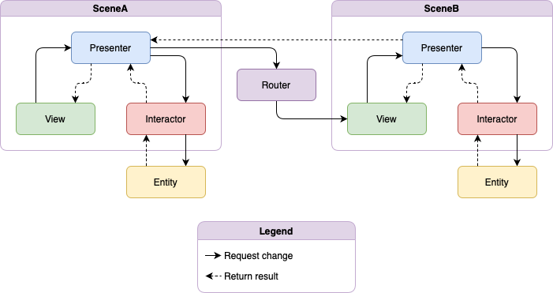

# IdealCleanArchitecture

Modular clean architecture implementation. If you're looking to start a new project and familiar with Redux I'd recommend The Composable Architecture (TCA). But if your team prefers/understands Clean Architecture this is a great way to enforce the boundaries between layers.

Package structure:
```
App
\ Dependencies
  \ ServiceA
  \ ServiceB
  \ ViewControllerFactoryA
  \ ViewControllerFactoryB

Modules
\ ModuleName
  \ Core
    \ Entity
    \ Interactor
    \ Presenter
    \ Router
    \ ServiceType
    \ ViewControllerFactoryType
  \ CoreTests
    \ EntityTests
    \ InteractorTests
    \ PresenterTests
    \ RouterTests
  \ UI
    \ Stylesheet
    \ ViewController
  \ UITests
    \ ViewControllerSnapshotTests
```

By including the Router, Presenter, ServiceType, and ViewControllerFactoryType in the Core we can fully unit test the Routing and Presentation logic using spies/mocks of the Services and ViewControllers.

The only thing left is to then SnapshotTest the UI and/or UI test.

---

VIPER architecture style
```
View <-> Presenter
Presenter -> Router
Presenter <-> Interactor
Interactor <-> Entity
```


Passing data back typically happens between Views in VIPER, since the Router is unidirectional we don't have to worry about storage of child routers or any memory leaks there.

```swift
viewB.delegate = viewA
```

---

## Concepts Employed

I have employed several concepts to make this code more readable/usable.

### Swift Package Manager

Access is enforced using Swift Package Manager to ensure proper boundaries between vertical layers. Modules are created as horizontal layers within each layer.

### `@Dependency` Injection

Dependencies are injected in a similar fashion to `@EnvironmentObject` using `@Dependency`, however, `@Dependency` supports protocols, so it's easier to mock.

### `@dynamicMemberLookup` and `Phantom` Types

Models enforce type restrictions by leveraging `@dynamicMemberLookup` on top of `Phantom Types`. [More information avialable here](https://levelup.gitconnected.com/expressible-dynamic-phantom-types-513091b63f04)

### `@propertyWrapper` Styling

Styles are created using `@propertyWrapper`'s. [More information available here](https://betterprogramming.pub/view-styling-with-propertywrapper-92d8476e96a7)

### `@resultBuilder` `@AutoLayoutBuilder`

Constraints are created in a more Swifty way with support for nesting. [More information available here](https://betterprogramming.pub/autolayoutbuilder-294badac5015).

### `Assert` Testing

Tests are written with a little DSL I wrote over `XCTAssert`. [More information available here](https://betterprogramming.pub/assert-my-wrapper-framework-around-xctest-7d6bea2d05f9)
